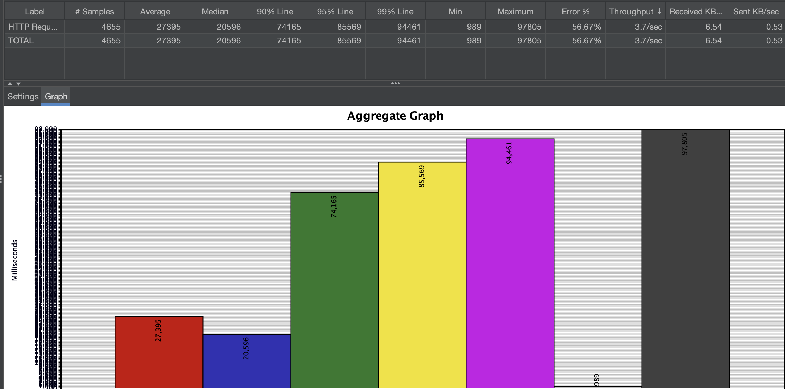
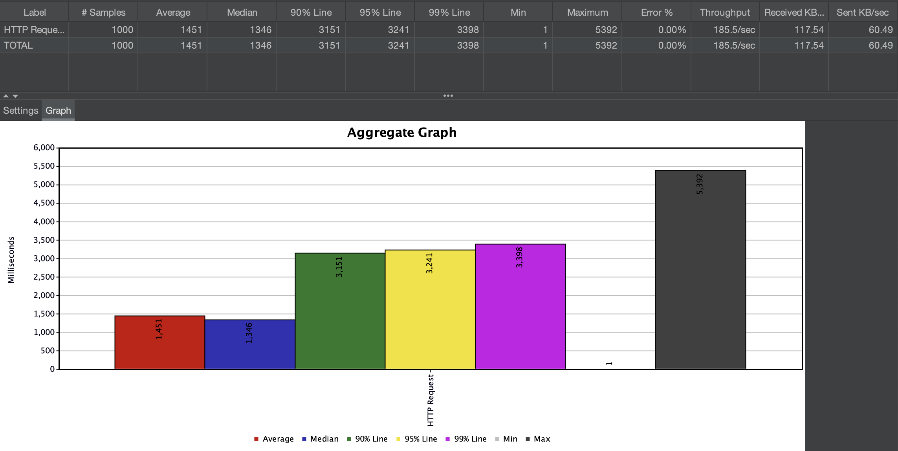

## 🌈 인기검색어 캐싱처리

### 인기검색어 캐싱 처리 이유 ❓

인기검색어는 사용자 요청이 빈번하지만, 데이터 자체는 자주 변경되지 않기 때문에
매 요청마다 SQL 쿼리를 실행하면 불필요한 DB 부하가 발생한다 생각이 들어 캐싱처리를 하게 되었다.

---

### 캐싱 처리 방법 📋

이를 개선하기 위해
Spring의 @Cacheable 애노테이션을 활용하여 일정 시간 동안 결과를 캐싱하도록 처리하였다.

---

### 캐싱 처리 전 😱

---

### 캐싱 처리 후 👍

---

### 처리 결과 📄

- 불필요한 DB 조회 감소
- 빠른 응답 속도 제공
- 캐시 만료 정책으로 최신성 유지

---

### 개선점 📝

스프링의 기본 캐시 기능(@Cacheable)은 TTL(캐시 유효 시간) 설정이 불가능하여, 캐시 갱신 주기를 제어할 수 없다.
이에 따라 향후에는 Redis를 도입하여 캐싱 주기 설정 및 유연한 캐시 관리가 가능하도록 개선할 예정이다.