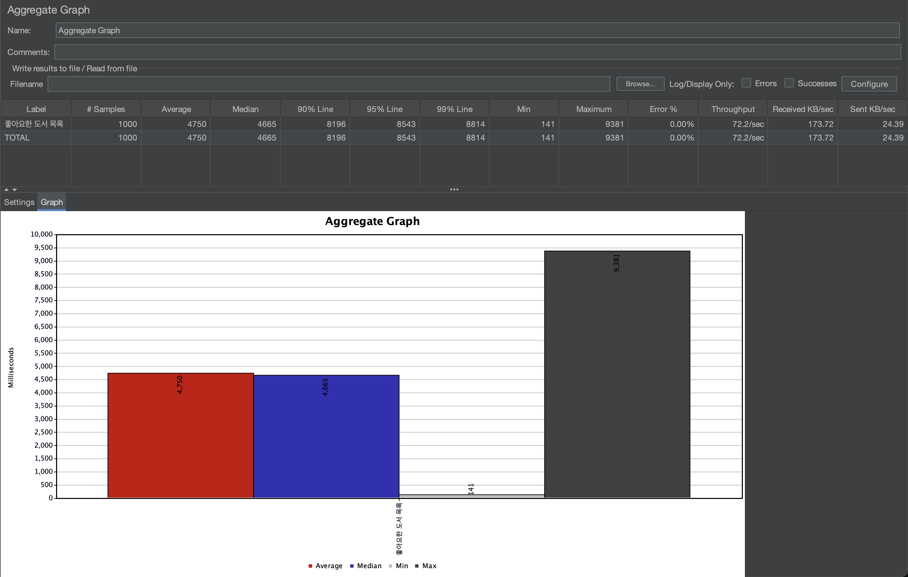
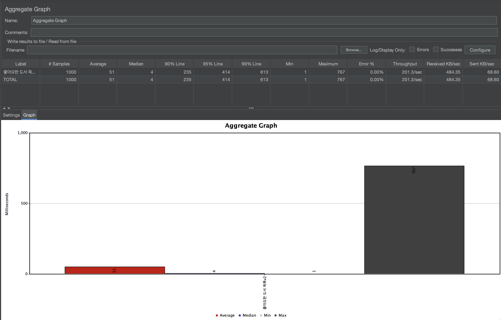

# 📚 좋아요 한 도서 목록 캐싱 적용

## ✅ 캐싱 적용 이유

### 1. 조회 빈도가 높음.

- 좋아요한 책 목록은 사용자의 마이페이지에서 조회하는 API.

  → 동일 요청이 반복될 가능성이 높음.

### 2. DB 부하 감소

- 'Like' 엔티티는 'User'와 'Book' 엔티티와 Join됨.

  → Join은 DB 성능에 큰 영향을 미침.

- 좋아요 목록은 데이터가 자주 변경되지 않기 때문에 동일한 페이징 결과를 반복적으로 조회하게 됨.

  → 캐싱을 통해 응답 속도를 향상시킬 수 있음.

## ✅ 캐싱 처리 전

## ✅ 캐싱 처리 후

