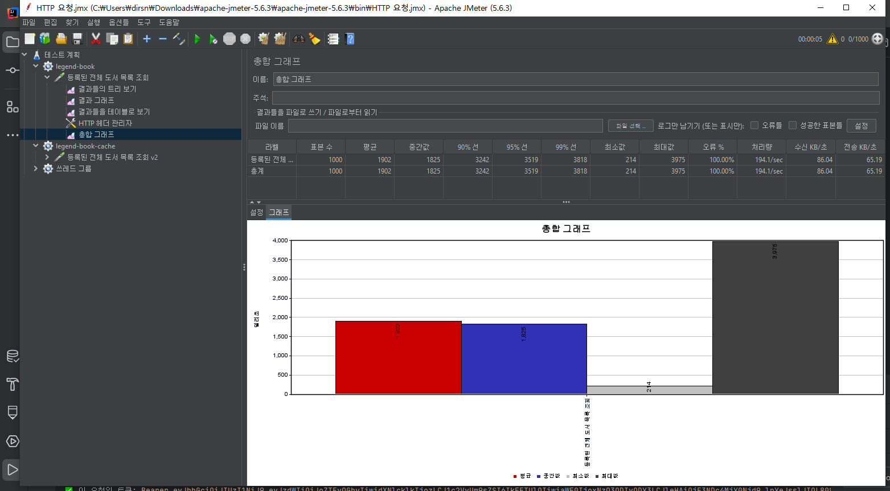
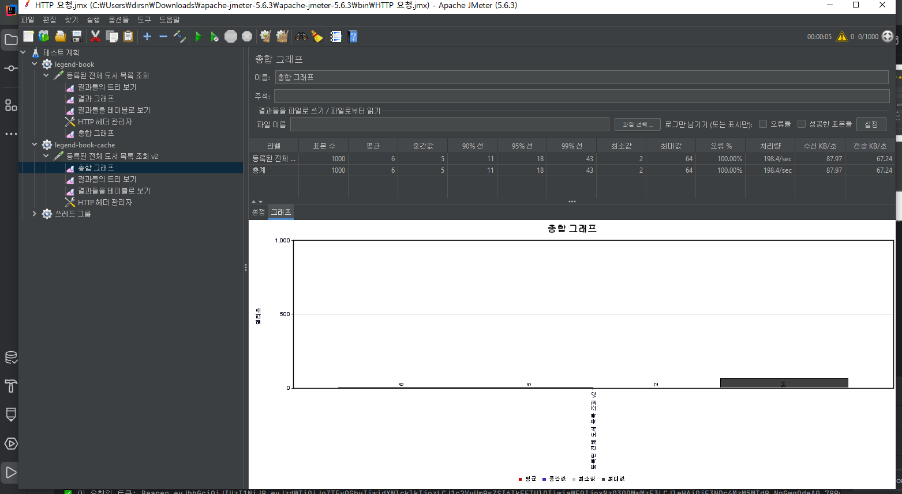

# 김태정 - 등록된 모든 도서 조회 캐싱 처리

## 캐싱 처리한 메서드

```java
// v1
public AdminPageResponse<AdminBookResponseDto> getAllBooks(int page, int size) {
    //생성일 기준 내림차순 정렬
    Pageable pageable = PageRequest.of(page - 1, size, Sort.by("createdAt").descending());

    Page<Book> bookPage = bookRepository.findAllByIsDeletedFalse(pageable);

    return new AdminPageResponse<>(bookPage, AdminBookResponseDto::new);
}

// v2
@Cacheable(value = "books", key = "'page1'", condition = "#page == 1")
public AdminPageResponse<AdminBookResponseDto> getAllBooksV2(int page, int size) {
    Pageable pageable = PageRequest.of(page - 1, size, Sort.by("createdAt").descending());

    Page<Book> bookPage = bookRepository.findAllByIsDeletedFalse(pageable);

    return new AdminPageResponse<>(bookPage, AdminBookResponseDto::new);
}
```

## 캐싱 처리한 이유

- 도서 목록의 1페이지는 사용자가 가장 자주 요청하는 화면입니다.

- 프론트에서 요청하는 size는 10으로 고정되어 있고, page == 1 조건만 캐싱하도록 설정했습니다.

- 복잡한 JOIN 쿼리는 아니지만, 자주 반복되는 요청을 줄이면 전체 DB 부하를 줄일 수 있습니다.

## 캐싱 처리 조건

- @Cacheable 어노테이션의 condition = "#page == 1" 옵션을 통해 1페이지 요청에만 캐싱을 적용했습니다.

- 그 외 페이지는 조회 빈도도 낮고, 단순 쿼리이기 때문에 캐싱하지 않았습니다.

## 기대 효과

- 데이터 베이스 부하 감소: 자주 호출되는 1페이지 요청을 캐시로 응답하므로 데이터 베이스 조회를 최소화

- 응답 속도 향상: 특히 트래픽이 많은 시간대에 성능 최적화 효과 큼

- 체감 성능 개선: 사용자가 느끼는 로딩 속도가 빨라짐

## 성능 테스트 방법

- 테스트 도구: Apache JMeter

- 테스트 설정:
    - Thread 수: 1000
    - Ramp-up 시간: 5초
    - Loop Count: 1

- 테스트 대상 메서드:
    - V1: `/api/admin/books`
    - V2: `/api/v2/admin/books`

> 동일 조건으로 테스트하여 V1과 V2의 처리 속도 및 DB 쿼리 수 차이를 비교함

## v1과 v2 성능 비교

### 기존 메서드(v1)

- 모든 요청마다 데이터 베이스에 접근해 데이터를 가져옴



### 캐싱 처리한 메서드(v2)

- page == 1 조건으로만 캐싱 적용

- 반복 호출 시 데이터 베이스 접근 없이 캐시에서 바로 응답



