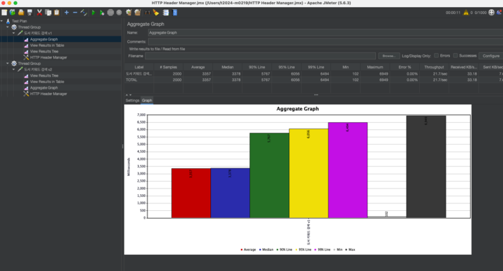
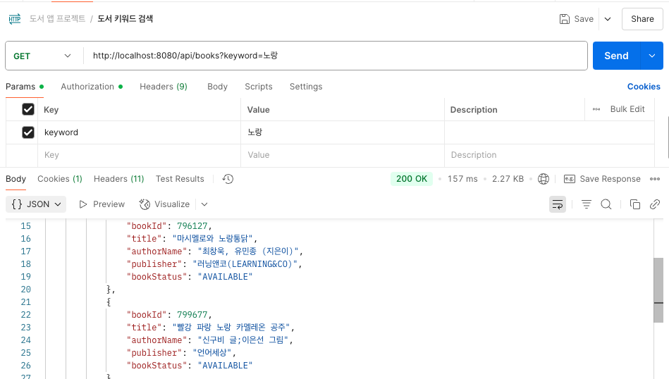
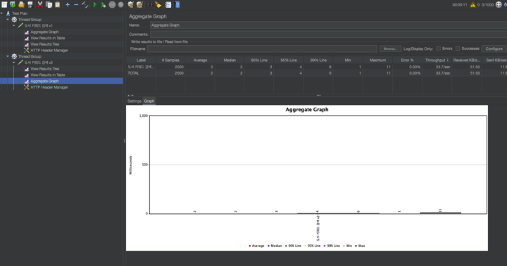
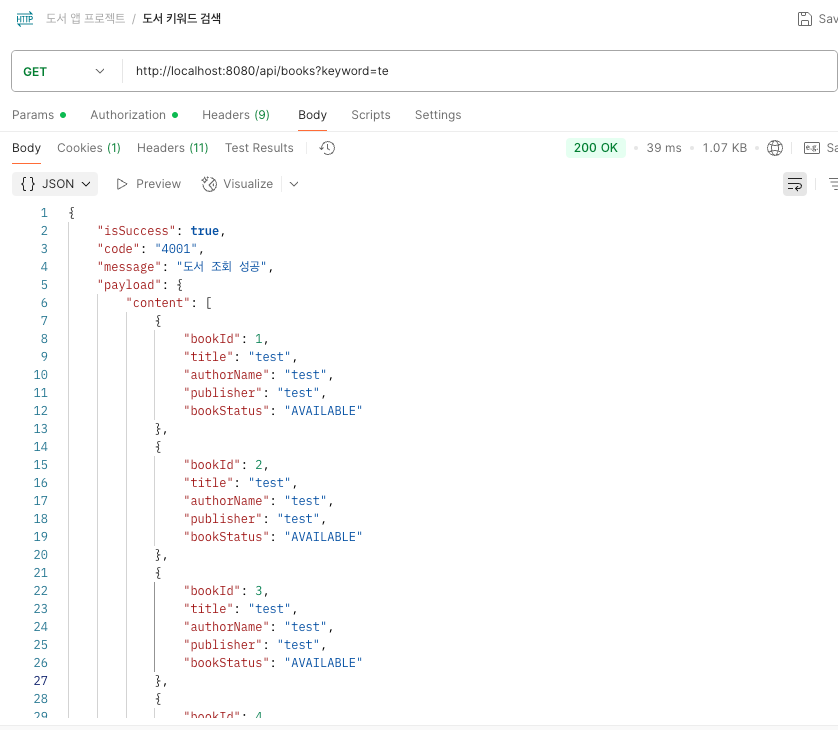

# 📚 Book 도서 키워드 검색 캐싱 처리

## 목적

도서 데이터가 약 15만개 정도 있는 데이터베이스에서, 사용자가 입력한 키워드로 도서를 검색할 때마다 데이터베이스에 직접 접근하게 되면 여러 요청이 반복될수록 응답 속도가
느려지고, 서버의 과부하가 생기게 됩니다.
이러한 문제를 해결하기 위해, 동일한 키워드와 페이지 조건으로 반복되는 검색 요청에 대해 캐싱 전략을 적용하게 되었습니다.

---

### 테스트 환경

- **Apache JMeter** 사용
- **Thread**: 1000 users
- **Ramp-Up Period**: 5 seconds
- **Loop Count**: 1

동일 키워드로 1000회 반복 요청<br>
캐싱 적용 전후의 평균 응답 시간

## 캐싱 적용 전(도서 키워드 검색 메서드)

```java
// 캐시 x
public Page<BookResponseDto> searchByTitleWithoutCache(String keyword, Pageable pageable) {
    Page<Book> searchedBooks = bookRepository.findByTitle(keyword, pageable);
    keywordRepository.save(Keyword.of(keyword));
    return BookResponseDto.fromEntityPage(searchedBooks);
}
```

캐싱 적용 전에는 여러 사용자가 키워드를 가지고 도서검색을 하게 되면 매 요청 마다 DB에 접근하게 되면서 높은 요청 빈도로 인해 성능에 저하와 응답이 지연되는 것을 알 수
있습니다.

### JMeter 성능 테스트 결과



### 포스트맨 응답 시간 결과



---

## 캐싱 적용 후(도서 키워드 검색 메서드)

- 캐시 이름: `bookSearchCache`
- `"{keyword}_{pageNumber}_{pageSize}"`: 키워드,페이지 정보를 조합하여 페이징 캐시 충돌 방지
- 동일한 검색 조건으로 들어온 요청들은 인 메모리 캐시에서 결과를 반환하도록 했습니다.
- 최초 요청에만 DB를 조회하고, 이후 동일한 요청을 할 시에는 캐시된 데이터를 재요청하도록 했습니다.

### 캐싱 적용 코드

```java

@Cacheable(
    value = "bookSearchCache",
    key = "#keyword + '_' + #pageable.pageNumber + '_' + #pageable.pageSize"
)
public Page<BookResponseDto> searchByTitle(String keyword, Pageable pageable) {
    Page<Book> searchedBooks = bookRepository.findByTitle(keyword, pageable);
    keywordRepository.save(Keyword.of(keyword));
    return BookResponseDto.fromEntityPage(searchedBooks);
}
```

### JMeter 성능 테스트 결과



### 포스트맨 응답 시간 결과



---

## 결론

- 캐싱 후 인 메모리 캐시에서 반환하여 응답 속도를 감소 및 DB 부하 감소로 서버 안정성 향상

---

## 추가해 볼 기능

- TTL 설정을 통해 캐시 자동으로 제거
- Redis 기반 분산 캐시로 확장